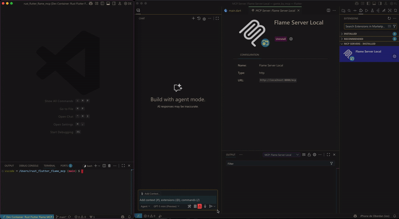
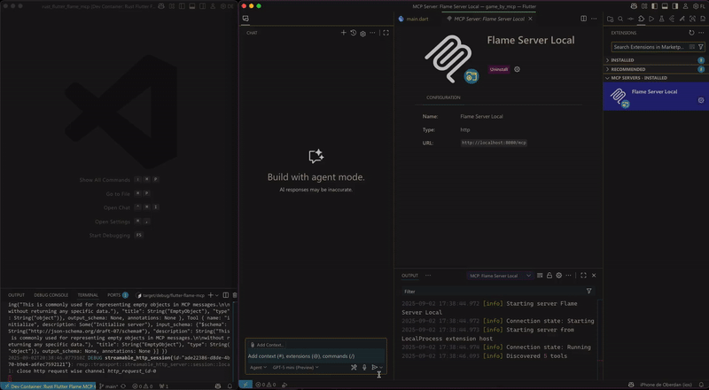
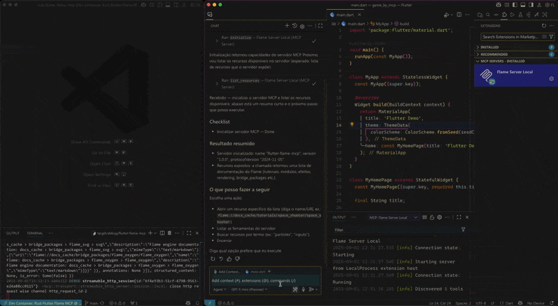

O **MCP (Model Context Protocol)** é um protocolo aberto desenvolvido pela Anthropic para conectar assistentes de IA a ferramentas e dados externos. Ele permite que IAs como o Claude ou Copilot acessem APIs, bancos de dados ou softwares específicos, expandindo suas capacidades além do ambiente padrão.

Um servidor MCP funciona como um intermediário: recebe solicitações da IA e executa ações reais, como consultar dados em tempo real ou integrar ferramentas de desenvolvimento. Exemplos de uso incluem:
- Automação de tarefas em editores de código.
- Análise de dados via APIs.
- Criação de aplicações interativas com jogos ou dashboards.

O **Flame** é uma biblioteca de código aberto (open-source) para criar jogos 2D usando a linguagem Dart e o toolkit Flutter. Ela funciona como um motor de jogos simples e modular.

Com o Flame é possível adicionar elementos como sprites (imagens animadas), física (gravidade e colisões), áudio, controles de toque e muito mais, tudo integrado ao Flutter. É ideal para desenvolvedores que querem criar jogos casuais, como jogos de plataforma ou quebra-cabeças, de forma rápida e eficiente.

Esse projeto é uma reprodução de [How I Built a Flame Engine MCP Server to Build Flutter Games](https://dev.to/salihgueler/how-i-built-a-flame-engine-mcp-server-to-build-flutter-games-3ea2) (não literal, pois foi desenvolvido em Rust, enquanto o original é Dart ), e tem como objetivo criar um servidor MCP disponibilizando exclusivamente a documentação e os tutoriais da biblioteca Flame, garantindo que o contexto da IA seja puro e focado nessa biblioteca.

## O projeto

Este projeto é composto por dois subprojetos: **git-download** (download dos arquivos de documentação do Flame) e **flutter-flame-mcp** (servidor MCP para expor a documentação do Flame a um agente de IA).

#### Git-download

O projeto **git-download** é uma ferramenta escrita em Rust que realiza o download da documentação do Flame hospedada no GitHub. Ela conecta-se à API do GitHub para listar apenas os arquivos de documentação em formato Markdown (.md) localizados na pasta **doc**, baixa os arquivos via comando do Git, armazenando-os em um diretório chamado **docs_cache** na raiz do projeto, preservando a estrutura de diretórios original.

**Atenção** — remoção do docs_cache: antes do início do processo de download, o diretório docs_cache é completamente removido. Isso pode causar perda de quaisquer alterações ou arquivos locais presentes nesse diretório. Caso necessário, faça backup de qualquer conteúdo importante antes de executar o download.

#### Configuração do token do GitHub

O projeto **git-download** requer um token do GitHub para acessar a API do GitHub. Para configurar o token, siga os passos abaixo:

1. Gere um token pessoal no GitHub com permissões de leitura de repositórios públicos. Instruções: https://docs.github.com/pt/authentication/keeping-your-account-and-data-secure/creating-a-personal-access-token

2. Configure a variável de ambiente `GITHUB_API_TOKEN` no seu terminal:
```bash
export GITHUB_API_TOKEN=<seu_token_aqui>
```

Dica: para persistir a variável, adicione a linha acima ao seu `~/.bashrc` ou `~/.profile`.

#### Flutter-flame-mcp

O projeto **flutter-flame-mcp** é o servidor MCP, implementado em Rust, focado em expor exclusivamente a documentação e tutoriais da biblioteca Flame para agentes de IA. 

O projeto acessa a documentação, baixada pelo **git-download**, realizando a listagem desses arquivos e a leitura de seu conteúdo sob demanda, permitindo que IAs acessem e consultem esses dados de forma estruturada, sem contexto externo.

A comunicação com os assistentes de IA é realizada através do que chamaremos de rotas de acesso:

- **Inicialização**
Quando a IA se conecta, ela chama essa rota para "apresentar" o servidor. O servidor responde com informações básicas, como seu nome ("flutter-flame-mcp"), versão e capacidades (possibilidade de listar e ler documentos, por exemplo). É o primeiro passo para configurar a conexão. Sem isso, a IA não sabe o que o servidor pode fazer.

- **Listagem de Recursos**
Lista todos os arquivos de documentação disponíveis na pasta **docs_cache**. Por exemplo, retorna uma lista de URIs como flame://docs_cache/resources/resources ou flame://docs_cache/tutorials/tutorials. O servidor devolve uma lista JSON com os caminhos relativos de cada arquivo, permitindo que a IA possa "navegar" pelos tópicos do Flame. É como um índice de livros.

- **Leitura de um Recurso**
Recebe uma URI (como flame://docs_cache/flame/flame) e devolve o conteúdo completo do arquivo correspondente em Markdown. Se o arquivo não existir, retorna um erro. Isso permite que a IA leia tutoriais ou guias específicos sobre o Flame, como, por exemplo, "como adicionar física em jogos". A IA pede o conteúdo de um tutorial, e o servidor responde com o texto puro do arquivo.

- **Ferramentas (Opcional)**
Essa rota permite expandir o servidor para tarefas além de leitura, como gerar código ou testar jogos Flame.

## Como executar o projeto

### Pré-requisitos

Para executar o projeto, é necessário ter o Rust instalado ou usar um dev container. O link para a instalação do Rust está na seção Referências.

### Passos para execução

Existem duas formas de iniciar o servidor MCP:

1. Atualizando a documentação do Flame antes de iniciar o servidor (execução do projeto **git-download**):
```bash
cargo run -p flutter-flame-mcp -- --download
# ou
cargo run -p flutter-flame-mcp -- -d
```
Isso fará o download dos arquivos de documentação do Flame e os armazenará em `docs_cache` localizado na raiz do projeto.

2. Sem atualizar a documentação:
```bash
cargo run -p flutter-flame-mcp
```

O servidor local estará disponível em `http://localhost:8080/mcp`.

#### Exemplos

<table>
  <tr>
    <td>
      <p align="center">
        
      </p>
      <p align="center">
        Iniciando o servidor MCP e realizando a conexão usando o Visual Studio Code.
      </p>
    </td>
  </tr>
  <tr>
    <td>
      <p align="center">
        
      </p>
      <p align="center">
        "Apresentação" para que a IA saiba o que o servidor pode fazer.
      </p>
    </td>
  </tr>
  <tr>
    <td>
      <p align="center">
        
      </p>
      <p align="center">
        Solicitar o tutorial do Space Shooter.
      </p>
    </td>
  </tr>
</table>


## Referências

- Documentação oficial do MCP: https://modelcontextprotocol.io/
- Repositório do Flame no GitHub: https://github.com/flame-engine/flame
- Documentação oficial do Flame: https://docs.flame-engine.org/latest/
- Instalação do Rust: https://www.rust-lang.org/pt-BR/tools/install