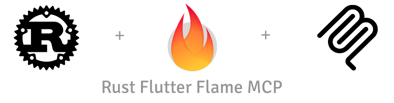

O MCP é um protocolo aberto desenvolvido pela Anthropic para conectar assistentes de IA a ferramentas e dados externos. Ele permite que IAs como o Claude ou Copilot acessem APIs, bancos de dados ou softwares específicos, expandindo suas capacidades além do ambiente padrão.

Um servidor MCP funciona como um intermediário: recebe solicitações da IA e executa ações reais, como consultar dados em tempo real ou integrar ferramentas de desenvolvimento. Exemplos de uso incluem:
- Automação de tarefas em editores de código.
- Análise de dados via APIs.
- Criação de aplicações interativas com jogos ou dashboards.

No contexto deste projeto, o servidor MCP expõe exclusivamente a documentação do Flame, garantindo que o contexto da IA seja puro e focado nessa biblioteca.

O Flame é uma biblioteca de código aberto (open-source) para criar jogos 2D usando a linguagem Dart e o toolkit Flutter. Ela funciona como um motor de jogos simples e modular.

Com o Flame é possível adicionar elementos como sprites (imagens animadas), física (gravidade e colisões), áudio, controles de toque e muito mais, tudo integrado ao Flutter. É ideal para desenvolvedores que querem criar jogos casuais, como jogos de plataforma ou quebra-cabeças, de forma rápida e eficiente.

Originalmente inspirado em ["How I Built a Flame Engine MCP Server to Build Flutter Games"](https://dev.to/salihgueler/how-i-built-a-flame-engine-mcp-server-to-build-flutter-games-3ea2), este projeto tem como objetivo criar um servidor MCP disponibilizando exclusivamente a documentação e os tutoriais da biblioteca Flame, permitindo que o contexto do agente de IA esteja focado exclusivamente nos dados relacionados ao Flame.

## O projeto

Este projeto é composto por dois subprojetos: **git-download** (download dos arquivos de documentação do Flame) e **flutter-flame-mcp** (servidor MCP para expor a documentação do Flame a um agente de IA).

#### Git-download

O projeto **git-download** é uma ferramenta escrita em Rust que realiza o download da documentação do Flame hospedada no GitHub. Ela conecta-se à API do GitHub para listar apenas os arquivos de documentação em formato Markdown (.md) localizados na pasta `doc`, baixa os arquivos via comandos do Git e os armazena em um diretório chamado `docs_cache` na raiz do projeto, preservando a estrutura de diretórios original.

Atenção — remoção do docs_cache: antes do início do processo de download, o diretório `docs_cache` é completamente removido. Isso pode causar perda de quaisquer alterações ou arquivos locais presentes nesse diretório. Faça backup de qualquer conteúdo importante em `docs_cache` antes de executar o download.

#### Configuração do token do GitHub

O projeto **git-download** requer um token do GitHub para acessar a API do GitHub. Para configurar o token, siga os passos abaixo:

1. Gere um token pessoal no GitHub com permissões de leitura de repositórios públicos. Instruções: https://docs.github.com/pt/authentication/keeping-your-account-and-data-secure/creating-a-personal-access-token

2. Configure a variável de ambiente `GITHUB_API_TOKEN` no seu terminal:
```bash
export GITHUB_API_TOKEN=<seu_token_aqui>
```

Dica: para persistir a variável, adicione a linha acima ao seu `~/.bashrc` ou `~/.profile`.

## Como executar o projeto

### Pré-requisitos

Para executar o projeto, é necessário ter o Rust instalado ou usar o dev container. O link para a instalação do Rust está na seção Referências.

### Passos para execução

Existem duas formas de iniciar o servidor MCP:

1. Atualizando a documentação do Flame (execução do projeto **git-download**):
```bash
cargo run -p flutter-flame-mcp -- --download
# ou
cargo run -p flutter-flame-mcp -- -d
```
Isso fará o download dos arquivos de documentação do Flame e os armazenará em `docs_cache` na raiz do projeto.

2. Sem atualizar a documentação:
```bash
cargo run -p flutter-flame-mcp
```

O servidor estará disponível em `http://localhost:8080/mcp` (porta padrão: 8080).

## Referências

- Documentação oficial do MCP: https://modelcontextprotocol.io/
- Repositório do Flame no GitHub: https://github.com/flame-engine/flame
- Documentação oficial do Flame: https://docs.flame-engine.org/latest/
- Instalação do Rust: https://www.rust-lang.org/pt-BR/tools/install